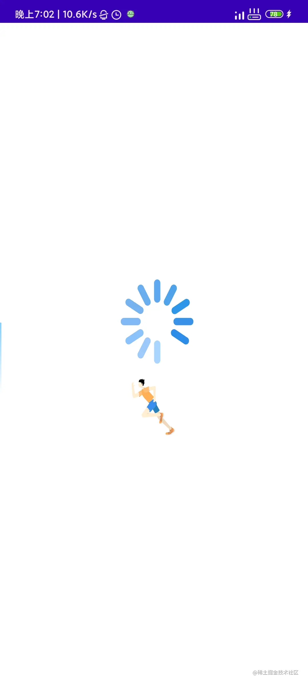
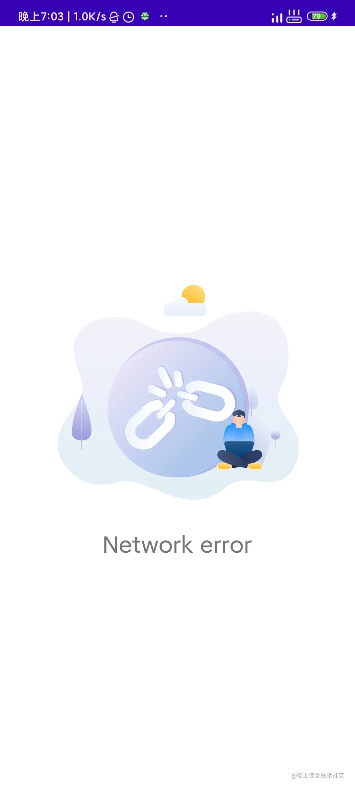

# 概览

`VastNetStateLayout` 继承自 [FrameLayout](https://developer.android.com/reference/android/widget/FrameLayout) 。你可以自定义下列状态页面: loading ，error ，ok ，empty data 。

## 特性

- 👍 支持自定义四种状态页面 `loading 加载页面` `empty data 空数据页面` `net error 网络错误页面` `retry 重试界面`
- 👍 支持自定义重试或者网络错误事件
- 👍 使用 `VastNetStateMgr` 进行界面管理
- 👍 设置有默认界面，添加即用

