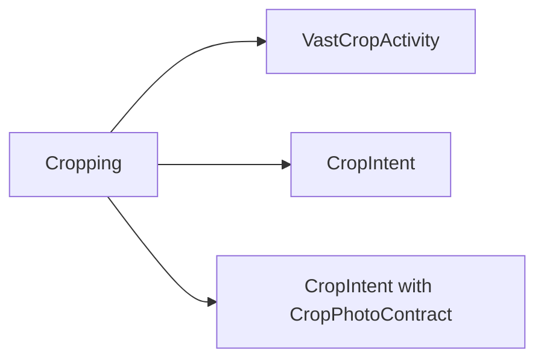

# Crop intent

## Quick start

You can choose the following three ways to call the cropping application. The main differences are as follows:

- If you use `VastCropActivity` , the cropping application built based on [CropViewLayout](https://ave.entropy2020.cn/documents/VastTools/core-topics/ui/cropview/crop-view/) will be used.
- If you use `CropIntent` , you need to obtain the `Uri` of the returned image and refer to [Uri permissions](#uri-permission) to revoke permissions.
- If you use `CropIntent` and `CropPhotoContract`, there is no need to set the `Uri` of the returned image and revoke permissions.



You can refer to [Sample code](#sample-code) to see a complete usage example.

## Set output picture name

[:octicons-tag-24: Version 0.4.0](https://ave.entropy2020.cn/version/VastTools/#040)

Call `setOutputName` to set output picture name，or take [value](https://doc.ave.entropy2020.cn/VastTools/com.ave.vastgui.tools.manager.mediafilemgr/-media-file-mgr/get-default-file-name.html) as the default value.

```kotlin
val cropIntent = CropIntent()
    ... // Other setting
    .setOutputName("Name defined by yourself.")
    .getIntent()
```

## Uri permission

[:octicons-tag-24: Version 0.4.0](https://ave.entropy2020.cn/version/VastTools/#040)

!!! danger "Uri permission"

    Because permission is granted to the specified uri in `setOutputUri`, you need to call `Context.revokeUriPermission` at the appropriate moment to cancel it. This operation is to solve the problem that the mobile phone shows that the photo saving fails. **This is not required if using `CropPhotoContract`** .

```kotlin
// Cancel permission of outputUri 
ContextHelper.getAppContext()
    .revokeUriPermission(outputUri, Intent.FLAG_GRANT_WRITE_URI_PERMISSION or Intent.FLAG_GRANT_READ_URI_PERMISSION)
```

## Sample code

[Sample code](https://github.com/SakurajimaMaii/Android-Vast-Extension/blob/develop/app/src/main/kotlin/com/ave/vastgui/app/activity/view/CropImageActivity.kt){ .md-button }
