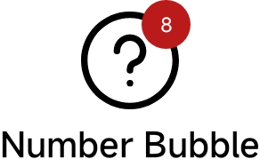
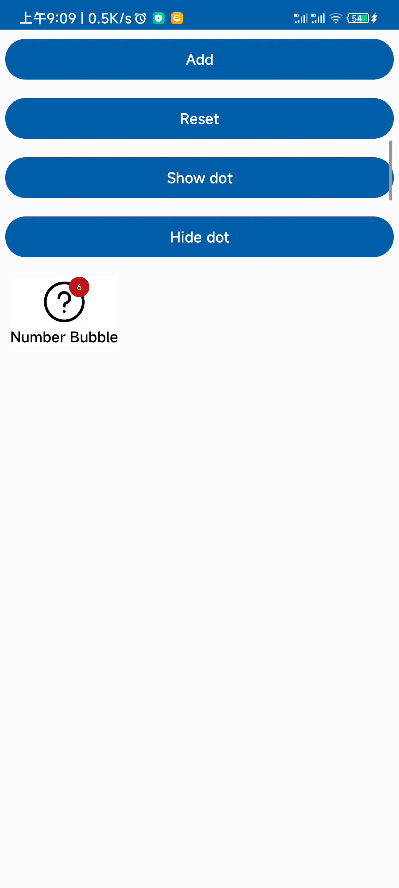

# 徽标布局

[:octicons-tag-24: Version 0.5.3](https://ave.entropy2020.cn/version/VastTools/#053)

`BadgeLayout` 默认提供徽标 `BadgeView` 和 `AppCompatImageView` ，其中徽标会在右上角展示，图标会以水平居中的方式展示。

<figure markdown>
  
  <figcaption>BadgeLayout</figcaption>
</figure>

## 标签设置

[:octicons-tag-24: Version 0.5.3](https://ave.entropy2020.cn/version/VastTools/#053)

`BadgeLayout` 只允许容纳一个类型为 `TextView` 的控件用以显示标签，以下是示例代码：

```xml
<com.ave.vastgui.tools.view.badgeview.BadgeLayout
    android:layout_width="wrap_content"
    android:layout_height="wrap_content"
    app:badge_mode="number">

    <com.google.android.material.textview.MaterialTextView
        android:layout_width="wrap_content"
        android:layout_height="wrap_content"
        android:text="Number Bubble" />

</com.ave.vastgui.tools.view.badgeview.BadgeLayout>
```

## 圆点徽标

### 显示徽标

[:octicons-tag-24: Version 0.5.3](https://ave.entropy2020.cn/version/VastTools/#053)

调用 `showDot` 和 `hideDot` 可以用来开启和关闭徽标。

```kotlin
// 展示徽标
mBinding.dotbadge.showDot()
// 隐藏徽标
mBinding.dotbadge.hideDot()
```

## 气泡徽标

[:octicons-tag-24: Version 0.5.3](https://ave.entropy2020.cn/version/VastTools/#053)

气泡徽标允许你拖动来消除，如下图所示：

<figure markdown>
  { width="270" }
  <figcaption>气泡徽标动画</figcaption>
</figure>

## 示例代码

[查看示例代码](https://github.com/SakurajimaMaii/Android-Vast-Extension/blob/develop/app/src/main/java/com/ave/vastgui/app/activity/view/BadgeViewActivity.kt){ .md-button }
