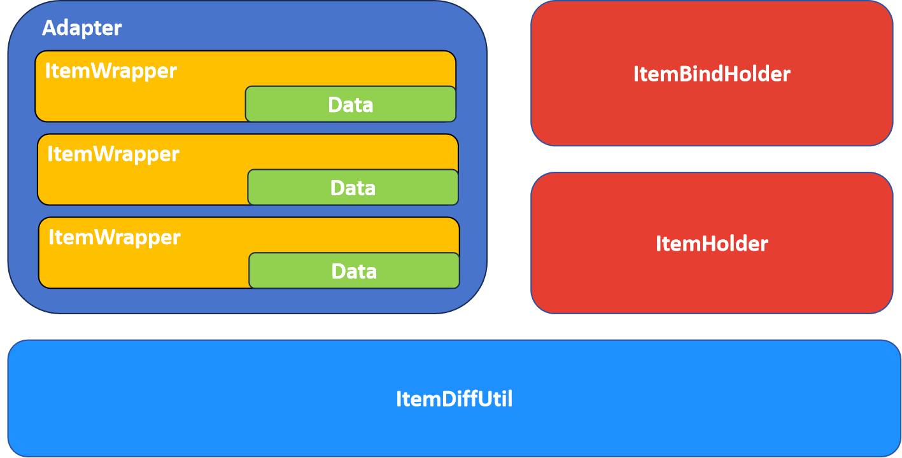
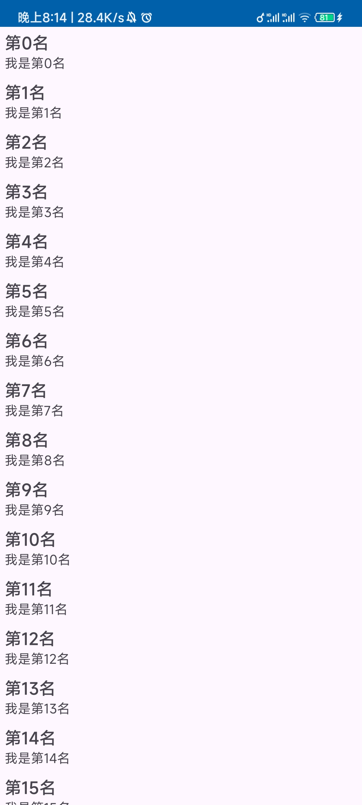

# 概览

[](https://img.shields.io/maven-central/v/io.github.sakurajimamaii/VastAdapter)
[](https://img.shields.io/badge/min%20sdk%20version-23-yellowgreen)
[](https://img.shields.io/badge/jdk%20version-17-2300b894)
[](https://www.apache.org/licenses/LICENSE-2.0)

`VastAdapter` 提供了便于 [RecyclerView](https://developer.android.com/develop/ui/views/layout/recyclerview?hl=zh-cn) 使用的通用适配器（Adapter）。其主要框架如下：

<figure markdown>
  { width="600" }
  <figcaption>VastAdapter 架构</figcaption>
</figure>

- Adapter
  
    适配器（Adapter）提供了 `BaseAdapter` ， `BaseListAdapter` ， `BasePagingAdapter` 以及针对[数据绑定](https://developer.android.com/topic/libraries/data-binding?hl=zh-cn)场景下的 `BaseBindAdapter` ， `BaseBindListAdapter` 和 `BaseBindPagingAdapter` 。

- ItemWrapper

    数据项包装器（ItemWrapper）用于为适配器（Adapter）提供布局资源 id 以及列表项点击事件。其目的在于分离数据项与布局，点击事件。

- Data

    列表内展示的数据项。

- ItemHolder 和 ItemBindHolder
- ItemDiffUtil

    用于解决适配器获取到的是 ItemWrapper 而非数据项本身的问题。

## 快速开始

[:octicons-tag-24: Version 1.1.1](https://sakurajimamaii.github.io/AVE-DOC/version/VastAdapter/#111)

下面以展示 `Person` 数据为例：

- `Person` 定义

    ```kotlin
    data class Person(val name: String, val sentence: String)
    ```

- `item_person` 定义
  
    ??? note "person 布局文件"

        ```xml
        <layout>
            <data>
                <variable name="person" type="com.ave.vastgui.app.adapter.entity.Person" />
            </data>
            <LinearLayout xmlns:android="http://schemas.android.com/apk/res/android"
                android:id="@+id/item_textview_root"
                android:layout_width="match_parent"
                android:layout_height="wrap_content"
                android:orientation="vertical"
                android:padding="5dp">
                <com.google.android.material.textview.MaterialTextView
                    android:id="@+id/name"
                    android:layout_width="match_parent"
                    android:layout_height="wrap_content"
                    android:gravity="start"
                    android:text="@{person.name}"
                    android:textSize="18sp"
                    android:textStyle="bold" />
                <com.google.android.material.textview.MaterialTextView
                    android:id="@+id/sentence"
                    android:layout_width="match_parent"
                    android:layout_height="wrap_content"
                    android:gravity="start"
                    android:text="@{person.sentence}" />
            </LinearLayout>
        </layout>
        ```

- 使用 `BaseBindAdapter` 作为适配器

    ```kotlin
    personRv.layoutManager = LinearLayoutManager(this)
    personRv.adapter = BaseBindAdapter(this, BR.person, ArrayList<ItemWrapper<Person>>().apply {
        repeat(20) {
            add(ItemWrapper(Person("第${it}名", "我是第${it}名"), R.layout.item_person))
        }
    })
    ```

<figure markdown>
  { width="300" }
</figure>

## 依赖

当前版本 

=== "gradle"

    ```groovy
    implementation 'io.github.sakurajimamaii:VastAdapter:$version'
    ```

=== "kts"

    ```kotlin
    implementation("io.github.sakurajimamaii:VastAdapter:$version")
    ```
