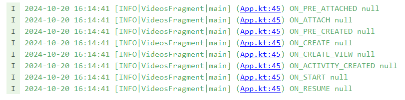
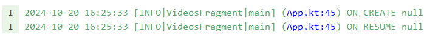
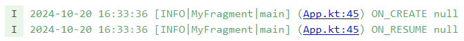

# 生命周期日志

[:octicons-tag-24: Version 1.3.10](https://sakurajimamaii.github.io/AVE-DOC/version/log-core/#1310)

!!! tip "LifecykleLog"

    该功能基于 [LifecykleLog](https://github.com/Chesire/LifecykleLog) 改造。

## 快速开始

[:octicons-tag-24: Version 1.3.10](https://sakurajimamaii.github.io/AVE-DOC/version/log-core/#1310)

- 在 [Application](https://developer.android.com/reference/android/app/Application) 调用 [registerLifecycleLogcat](https://api.ave.entropy2020.cn/log/android/com.log.vastgui.android.lifecycle/-activity-lifecycle-logcat/-companion/register-lifecycle-logcat.html) 注册回调监听：

    ```kotlin
    class App : Application() {

        override fun onCreate() {
            super.onCreate()
            registerLifecycleLogcat { tag, event, bundle ->
                // ...
            }
        }

    }
    ```

- 在需要进行日志记录的 [Activity](https://developer.android.com/guide/components/activities/intro-activities) 和 [Fragment](https://developer.android.com/guide/fragments) 上添加 [LogLifecycle](https://api.ave.entropy2020.cn/log/android/com.log.vastgui.android.lifecycle/-log-lifecycle/index.html) 注解：

    ```kotlin title="FileActivity.kt"
    @LogLifecycle
    class FileActivity : AppCompatActivity(R.layout.activity_file) {

    }
    ```

    ```kotlin title="VideosFragment.kt"
    @LogLifecycle 
    class VideosFragment : VastVbVmFragment<FragmentVideosBinding, SharedVM>() {

    }
    ```

    这样就可以看到相关的生命周期：

    

## 指定生命周期

[:octicons-tag-24: Version 1.3.10](https://sakurajimamaii.github.io/AVE-DOC/version/log-core/#1310)

通过 [LogLifecycle.obverseEvent](https://api.ave.entropy2020.cn/log/android/com.log.vastgui.android.lifecycle/-log-lifecycle/obverse-event.html) 可以指定记录的生命周期：

```kotlin title="VideosFragment.kt"
@LogLifecycle(obverseEvent = [LogLifecycleEvent.ON_CREATE, LogLifecycleEvent.ON_RESUME])
class VideosFragment : VastVbVmFragment<FragmentVideosBinding, SharedVM>() {

}
```

这样就可以只打印生命周期：



## 自定义日志类名

[:octicons-tag-24: Version 1.3.10](https://sakurajimamaii.github.io/AVE-DOC/version/log-core/#1310)

通过 [LogLifecycle.name](https://api.ave.entropy2020.cn/log/android/com.log.vastgui.android.lifecycle/-log-lifecycle/name.html) 可以自定义日志类名：

```kotlin title="VideosFragment.kt"
@LogLifecycle("MyFragment", [LogLifecycleEvent.ON_CREATE, LogLifecycleEvent.ON_RESUME])
class VideosFragment : VastVbVmFragment<FragmentVideosBinding, SharedVM>() {

}
```



## 添加依赖

当前版本 

=== "gradle"

    ```groovy
    implementation 'io.github.sakurajimamaii:log-android:$version'
    ```

=== "kts"

    ```kotlin
    implementation("io.github.sakurajimamaii:log-android:$version")
    ```