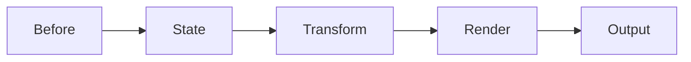
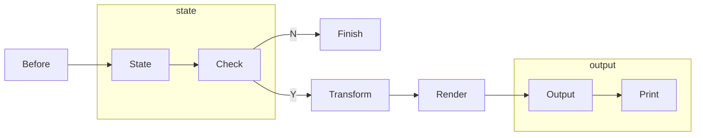

# 高级 

!!! tip "特别致谢"

    感谢 [ywnkm](https://github.com/ywnkm) 对该功能的开发。

[:octicons-tag-24: Version 1.3.4](https://sakurajimamaii.github.io/AVE-DOC/version/log-core/#134)

从 [1.3.4](https://sakurajimamaii.github.io/AVE-DOC/version/log-core/#134) 版本开始，日志的处理流程采用 Pipeline 模式，
默认情况分为以下几个阶段：



那么当你安装插件后，就可以改变日志的处理流程，以日志打印为例：



对应的代码实现：

```kotlin
// LogPrinter.kt
override fun install(plugin: LogPrinter, scope: LogCat) {
    scope.logPipeline.intercept(LogPipeline.State) {
        if (plugin.levelMap[subject.level] == false) {
            finish()
        }
    }
    scope.logPipeline.intercept(LogPipeline.Output) {
        val logInfo = subject.build()
        plugin.printLog(logInfo)
        proceed()
    }
}
```

[查看完整代码](https://github.com/SakurajimaMaii/Android-Vast-Extension/blob/develop/libraries/log/core/src/main/kotlin/com/log/vastgui/core/plugin/LogPrinter.kt){ .md-button }

基于此原理你可以开发自定义插件来对日志流程进行控制。
