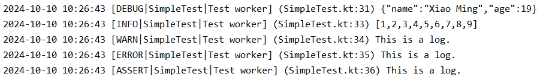
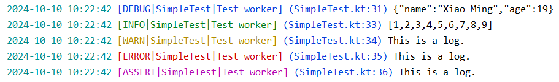
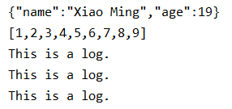

# 格式化

[:octicons-tag-24: Version 1.3.4](https://sakurajimamaii.github.io/AVE-DOC/version/log-core/#134)

=== "表格风格(TableFormat)"
    
    <figure markdown="span">
    
    </figure>

=== "线性风格(LineFormat)"

    <figure markdown="span">
    
    </figure>

=== "多彩线性风格(LineColorfulFormat)"

    <figure markdown="span">
    
    </figure>

=== "简约模式(OnlyMsgFormat)"

    <figure markdown="span">
    
    </figure>

这些都是基于 [LogFormat](https://api.ave.entropy2020.cn/log/core/com.log.vastgui.core.base/-log-format/index.html) 实现的。你可以为 [Logger](https://api.ave.entropy2020.cn/log/core/com.log.vastgui.core.base/-logger/index.html) 设置 `LogFormat` 来对日志内容进行格式化，例如当使用 [Logger.android()](https://api.ave.entropy2020.cn/tools/com.ave.vastgui.tools.log/android.html) 时可以指定 [OnlyMsgFormat](https://api.ave.entropy2020.cn/log/core/com.log.vastgui.core.format/-only-msg-format/index.html?query=object%20OnlyMsgFormat%20:%20LogFormat) 。

```kotlin
val logFactory: LogFactory = getLogFactory {
    ...
    install(LogPrinter) {
        // 指定 logFormat 为 OnlyMsgFormat
        logger = Logger.android(logFormat = OnlyMsgFormat)
    }
}
```

当然你也可以实现 [LogFormat](https://api.ave.entropy2020.cn/log/core/com.log.vastgui.core.base/-log-format/index.html) 来自定义你的风格，以 [OnlyMsgFormat](https://api.ave.entropy2020.cn/log/core/com.log.vastgui.core.format/-only-msg-format/index.html) 为例：

```kotlin
object OnlyMsgFormat : LogFormat {
    override fun format(logInfo: LogInfo) = logInfo.mContent
}
```
