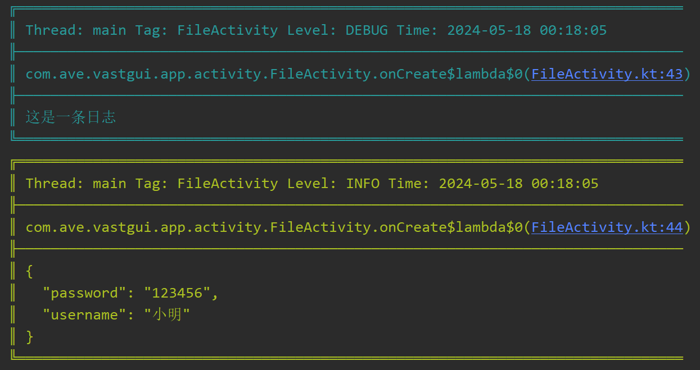

# 格式化

[:octicons-tag-24: Version 1.3.4](https://ave.entropy2020.cn/version/log-core/#134)

在 [概览](https://ave.entropy2020.cn/documents/log/description/) 中展示了几种日志风格，例如下图所示：

<figure markdown="span">
    { width="500" }
    <figcaption>日志风格示例</figcaption>
</figure>

这些都是基于 [LogFormat](https://api.ave.entropy2020.cn/log/core/com.log.vastgui.core.base/-log-format/index.html) 实现的。你可以为 [Logger](https://api.ave.entropy2020.cn/log/core/com.log.vastgui.core.base/-logger/index.html) 设置 `LogFormat` 来对日志内容进行格式化，以下是示例：

```kotlin
val mLogFactory: LogFactory = getLogFactory {
    ...
    install(LogPrinter) {
        // 指定 logFormat 为 OnlyMsgFormat
        logger = Logger.android(logFormat = OnlyMsgFormat)
    }
}
```

当然你也可以实现 [LogFormat](https://api.ave.entropy2020.cn/log/core/com.log.vastgui.core.base/-log-format/index.html) 来自定义你的风格，以 [OnlyMsgFormat](https://api.ave.entropy2020.cn/log/core/com.log.vastgui.core.format/-only-msg-format/index.html) 为例：

```kotlin
object OnlyMsgFormat : LogFormat {
    override fun format(logInfo: LogInfo) = logInfo.mContent
}
```
