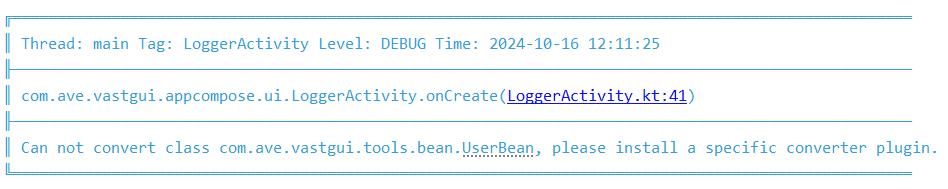
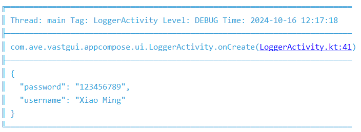

# Json 格式化

[:octicons-tag-24: Version 1.3.1](https://sakurajimamaii.github.io/AVE-DOC/version/log-core/#131)

默认情况下，如果直接将**对象**作为日志打印内容，则会出现以下错误：

```kotlin
logcat.d(UserBean("Xiao Ming", "123456789"))
```



[LogJson](https://api.ave.entropy2020.cn/log/core/com.log.vastgui.core.plugin/-log-json/index.html) 允许你将对象以 json 的形式打印：

```kotlin
val gson = GsonConverter.getInstance(true)

val logFactory: LogFactory = getLogFactory {
    ...
    install(LogJson) {
        converter = gson
    }
}
```

以下是成功打印示例：



## 添加依赖

=== "Gson"

    

    ```kotlin
    implementation("com.google.code.gson:gson:$version")
    ```

=== "Fastjson2"

    

    ```kotlin
    implementation("com.alibaba.fastjson2:fastjson2:$version")
    ```

=== "Jackson"

    

    ```kotlin
    implementation("com.fasterxml.jackson.core:jackson-databind:$version")
    ```
