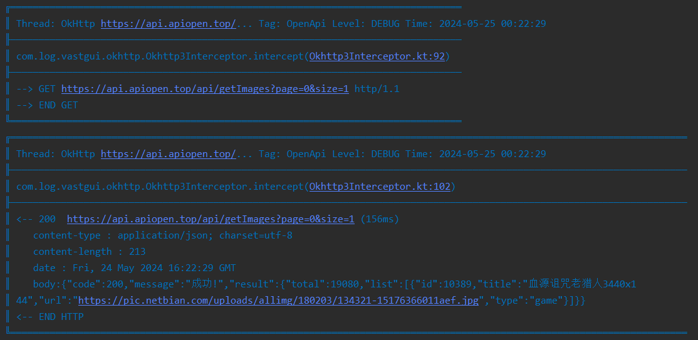
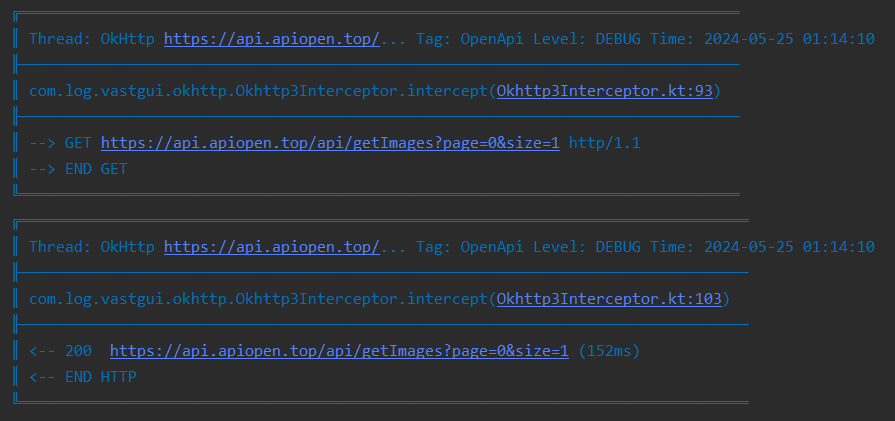

# 使用

[:octicons-tag-24: Version 1.3.3](https://ave.entropy2020.cn/version/log-okhttp/#133)

通过将 [Okhttp3Interceptor](https://api.ave.entropy2020.cn/log/okhttp/com.log.vastgui.okhttp/-okhttp3-interceptor/index.html) 添加为 [Okhttp](https://square.github.io/okhttp/) 拦截器，便可轻松打印请求日志：

```kotlin
class OpenApi : RequestBuilder("https://api.apiopen.top") {
    ...

    override fun okHttpConfiguration(builder: OkHttpClient.Builder) {
        super.okHttpConfiguration(builder)
        mLogger = mLogFactory.getLog(OpenApi::class.java)
        mOkhttp3Interceptor = Okhttp3Interceptor.getInstance(mLogger)
        builder.addInterceptor(mOkhttp3Interceptor)
    }
}
```

[查看示例代码](https://github.com/SakurajimaMaii/Android-Vast-Extension/blob/develop/app/src/main/kotlin/com/ave/vastgui/app/App.kt){ .md-button }

以下是打印的日志示例：

<figure markdown>
  { width="800" }
  <figcaption>请求日志示例</figcaption>
</figure>

## 过滤器

[:octicons-tag-24: Version 1.3.3](https://ave.entropy2020.cn/version/log-okhttp/#133)

通过 [Okhttp3Interceptor](https://api.ave.entropy2020.cn/log/okhttp/com.log.vastgui.okhttp/-okhttp3-interceptor/index.html) 提供的 [filter](https://api.ave.entropy2020.cn/log/okhttp/com.log.vastgui.okhttp/-okhttp3-interceptor/filter.html) 你可以对请求进行过滤，例如请求链接中必须包含 **getPhoto** :

```kotlin
mOkhttp3Interceptor.apply {
    filter = {
        it.url.host.contains("getPhoto")
    }
}
```

## 内容级别

[:octicons-tag-24: Version 1.3.3](https://ave.entropy2020.cn/version/log-okhttp/#133)

通过 [Okhttp3Interceptor](https://api.ave.entropy2020.cn/log/okhttp/com.log.vastgui.okhttp/-okhttp3-interceptor/index.html) 提供的 [contentLevel
](https://api.ave.entropy2020.cn/log/okhttp/com.log.vastgui.okhttp/-okhttp3-interceptor/content-level.html) 你可以设置日志的打印内容，例如可以只打印日志的请求信息：

```kotlin
mOkhttp3Interceptor.apply {
    contentLevel = ContentLevel.INFO
}
```

<figure markdown>
  { width="800" }
  <figcaption>仅打印日志请求信息</figcaption>
</figure>

!!! note "内容级别默认值"

    [contentLevel](https://api.ave.entropy2020.cn/log/okhttp/com.log.vastgui.okhttp/-okhttp3-interceptor/content-level.html) 的默认值为 [ContentLevel.ALL](https://api.ave.entropy2020.cn/log/okhttp/com.log.vastgui.okhttp.base/-content-level/-a-l-l/index.html)

## 请求日志级别

[:octicons-tag-24: Version 1.3.3](https://ave.entropy2020.cn/version/log-okhttp/#133)

通过 [Okhttp3Interceptor](https://api.ave.entropy2020.cn/log/okhttp/com.log.vastgui.okhttp/-okhttp3-interceptor/index.html) 提供的 [requestLevel](https://api.ave.entropy2020.cn/log/okhttp/com.log.vastgui.okhttp/-okhttp3-interceptor/request-level.html) 你可以设置请求内容的日志级别：

```kotlin
mOkhttp3Interceptor.apply {
    requestLevel = { request ->  
        if(request.url.host.contains("127.0.0.1")){
            LogLevel.DEBUG
        } else {
            LogLevel.INFO
        }
    }
}
```

!!! note "请求日志级别默认值"

    [requestLevel](https://api.ave.entropy2020.cn/log/okhttp/com.log.vastgui.okhttp/-okhttp3-interceptor/request-level.html) 的默认值为 [LogLevel.DEBUG](https://api.ave.entropy2020.cn/log/core/com.log.vastgui.core.base/-log-level/-d-e-b-u-g/index.html)

## 回复日志级别

[:octicons-tag-24: Version 1.3.3](https://ave.entropy2020.cn/version/log-okhttp/#133)

通过 [Okhttp3Interceptor](https://api.ave.entropy2020.cn/log/okhttp/com.log.vastgui.okhttp/-okhttp3-interceptor/index.html) 提供的 [responseLevel](https://api.ave.entropy2020.cn/log/okhttp/com.log.vastgui.okhttp/-okhttp3-interceptor/response-level.html) 你可以设置回复内容的日志级别：

```kotlin
mOkhttp3Interceptor.apply {
    responseLevel = { response ->
        if (200 == response.code) {
            LogLevel.DEBUG
        } else {
            LogLevel.ERROR
        }
    }
}
```

!!! note "回复日志级别默认值"

    [responseLevel](https://api.ave.entropy2020.cn/log/okhttp/com.log.vastgui.okhttp/-okhttp3-interceptor/response-level.html) 的默认值为 [LogLevel.DEBUG](https://api.ave.entropy2020.cn/log/core/com.log.vastgui.core.base/-log-level/-d-e-b-u-g/index.html)
