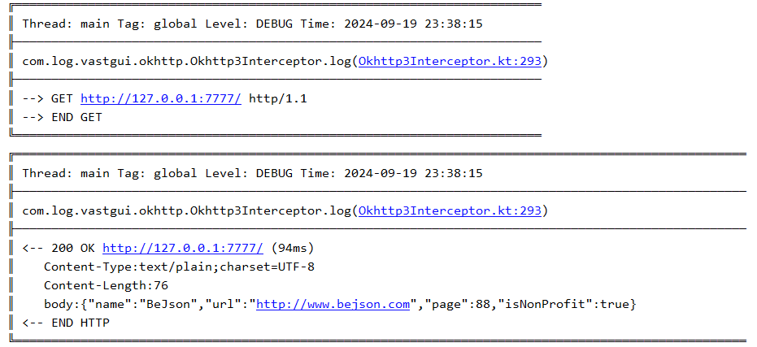
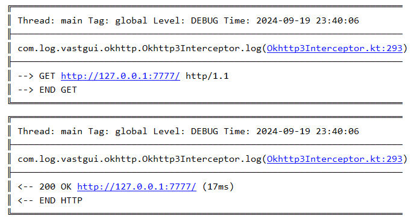
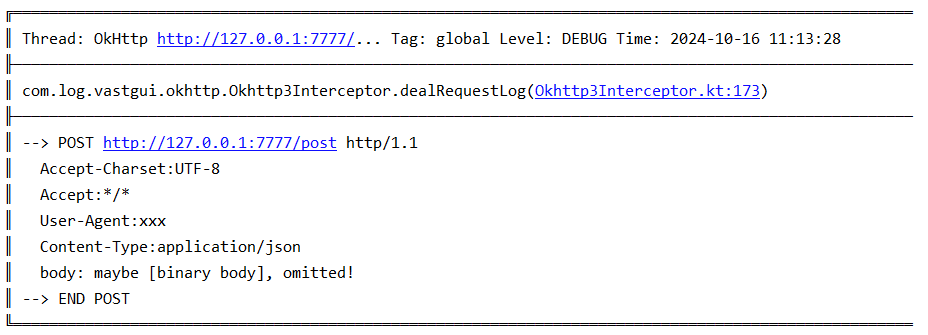

# 概述

[:octicons-tag-24: Version 1.3.3](https://sakurajimamaii.github.io/AVE-DOC/version/log-okhttp/#133)

通过将 [Okhttp3Interceptor](https://api.ave.entropy2020.cn/log/okhttp/com.log.vastgui.okhttp/-okhttp3-interceptor/index.html) 添加为 [Okhttp](https://square.github.io/okhttp/) 拦截器，便可轻松打印请求日志：

```kotlin
// Add Interceptor 
val logcat = logFactory("global") 
val okhttp = OkHttpClient
    .Builder()
    .addInterceptor(Okhttp3Interceptor(logcat))     
    .build()  
    
// Make a request 
val request: Request = Request.Builder()
    .url("http://127.0.0.1:7777")
    .build()
okhttp.newCall(request).execute()
```

[查看示例代码](https://github.com/SakurajimaMaii/Android-Vast-Extension/blob/develop/app/src/main/kotlin/com/ave/vastgui/app/App.kt){ .md-button }

以下是打印的日志示例：

<figure markdown>
  { width="800" }
  <figcaption>请求日志示例</figcaption>
</figure>

## 添加依赖

当前版本 

=== "gradle"

    ```groovy
    implementation 'io.github.sakurajimamaii:log-okhttp:$version'
    ```

=== "kts"

    ```kotlin
    implementation("io.github.sakurajimamaii:log-okhttp:$version")
    ```

## 过滤器

[:octicons-tag-24: Version 1.3.3](https://sakurajimamaii.github.io/AVE-DOC/version/log-okhttp/#133)

通过 [Okhttp3Interceptor](https://api.ave.entropy2020.cn/log/okhttp/com.log.vastgui.okhttp/-okhttp3-interceptor/index.html) 提供的 [filter](https://api.ave.entropy2020.cn/log/okhttp/com.log.vastgui.okhttp/-okhttp3-interceptor/filter.html) 你可以对请求进行过滤，例如请求链接中必须包含 **getPhoto** :

```kotlin
okhttp3Interceptor.apply {
    filter = {
        it.url.host.contains("getPhoto")
    }
}
```

## 内容级别

[:octicons-tag-24: Version 1.3.3](https://sakurajimamaii.github.io/AVE-DOC/version/log-okhttp/#133)

通过 [Okhttp3Interceptor](https://api.ave.entropy2020.cn/log/okhttp/com.log.vastgui.okhttp/-okhttp3-interceptor/index.html) 提供的 [contentLevel
](https://api.ave.entropy2020.cn/log/okhttp/com.log.vastgui.okhttp/-okhttp3-interceptor/content-level.html) 你可以设置日志的打印内容，例如可以只打印日志的请求信息：

```kotlin
okhttp3Interceptor.apply {
    contentLevel = ContentLevel.INFO
}
```

<figure markdown>
  { width="800" }
</figure>

!!! note "内容级别默认值"

    [contentLevel](https://api.ave.entropy2020.cn/log/okhttp/com.log.vastgui.okhttp/-okhttp3-interceptor/content-level.html) 的默认值为 [ContentLevel.ALL](https://api.ave.entropy2020.cn/log/okhttp/com.log.vastgui.okhttp.base/-content-level/-a-l-l/index.html)

## 请求日志级别

[:octicons-tag-24: Version 1.3.3](https://sakurajimamaii.github.io/AVE-DOC/version/log-okhttp/#133)

通过 [Okhttp3Interceptor](https://api.ave.entropy2020.cn/log/okhttp/com.log.vastgui.okhttp/-okhttp3-interceptor/index.html) 提供的 [requestLevel](https://api.ave.entropy2020.cn/log/okhttp/com.log.vastgui.okhttp/-okhttp3-interceptor/request-level.html) 你可以设置请求内容的日志级别：

```kotlin
okhttp3Interceptor.apply {
    requestLevel = { request ->  
        if(request.url.host.contains("127.0.0.1")){
            LogLevel.DEBUG
        } else {
            LogLevel.INFO
        }
    }
}
```

!!! note "请求日志级别默认值"

    [requestLevel](https://api.ave.entropy2020.cn/log/okhttp/com.log.vastgui.okhttp/-okhttp3-interceptor/request-level.html) 的默认值为 [LogLevel.DEBUG](https://api.ave.entropy2020.cn/log/core/com.log.vastgui.core.base/-log-level/-d-e-b-u-g/index.html)

## 回复日志级别

[:octicons-tag-24: Version 1.3.3](https://sakurajimamaii.github.io/AVE-DOC/version/log-okhttp/#133)

通过 [Okhttp3Interceptor](https://api.ave.entropy2020.cn/log/okhttp/com.log.vastgui.okhttp/-okhttp3-interceptor/index.html) 提供的 [responseLevel](https://api.ave.entropy2020.cn/log/okhttp/com.log.vastgui.okhttp/-okhttp3-interceptor/response-level.html) 你可以设置回复内容的日志级别：

```kotlin
okhttp3Interceptor.apply {
    responseLevel = { response ->
        if (200 == response.code) {
            LogLevel.DEBUG
        } else {
            LogLevel.ERROR
        }
    }
}
```

## 请求头隐藏

[:octicons-tag-24: Version 1.3.9](https://sakurajimamaii.github.io/AVE-DOC/version/log-okhttp/#139)

通过 [sanitizedHeaders()](https://api.ave.entropy2020.cn/log/okhttp/com.log.vastgui.okhttp/-okhttp3-interceptor/sanitized-headers.html) 可以将指定的请求头进行替换为隐藏字段：

```kotlin
Okhttp3Interceptor(logcat)
    .sanitizedHeaders("Authorization","***")
    .sanitizedHeaders("User-Agent","xxx")
```

则上述的请求头内容会被替换成指定内容：

<figure markdown>
  { width="800" }
</figure>

!!! note "回复日志级别默认值"

    [responseLevel](https://api.ave.entropy2020.cn/log/okhttp/com.log.vastgui.okhttp/-okhttp3-interceptor/response-level.html) 的默认值为 [LogLevel.DEBUG](https://api.ave.entropy2020.cn/log/core/com.log.vastgui.core.base/-log-level/-d-e-b-u-g/index.html)
