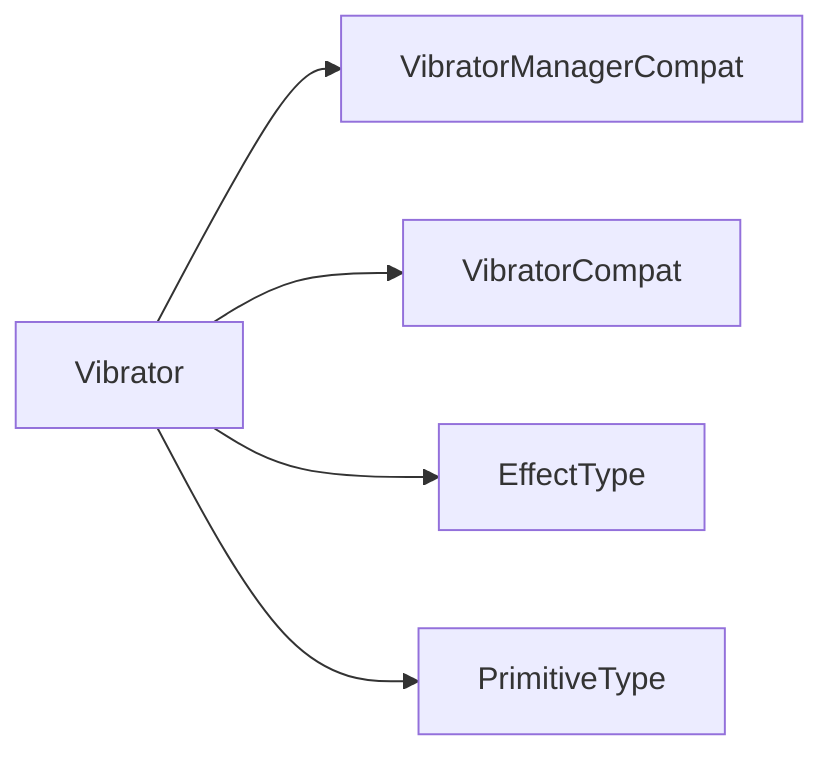

# 振动器

> 添加：[:octicons-tag-24: Version 1.5.2](https://sakurajimamaii.github.io/AVE-DOC/version/tools/#152)

`VibratorManagerCompat` 和 `VibratorCompat` 能够以兼容的方式去访问设备振动器。

## 示例代码

[查看示例代码](https://github.com/SakurajimaMaii/Android-Vast-Extension/blob/develop/app/src/main/kotlin/com/ave/vastgui/app/activity/VibratorActivity.kt){ .md-button }
