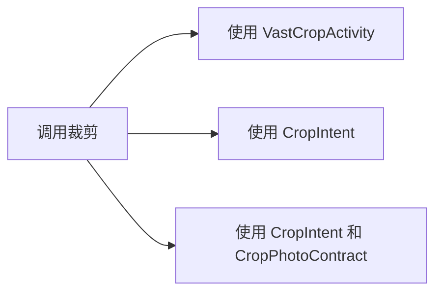

# 裁剪照片

`CropIntent` 允许你快速构建裁剪照片的 Intent 。输出格式为 `jpg` 。

!!! tip "CropIntent 和 CropPhotoContract"

    建议配合 [CropPhotoContract](https://ave.entropy2020.cn/documents/VastTools/app-entry-points/activities/ActivityResult/#cropphotocontract) 使用

## 快速使用

你可以选择以下三种方式来调用裁剪应用，其主要区别如下：

- 如果使用 `VastCropActivity` ，则会通过基于 [CropViewLayout](https://ave.entropy2020.cn/documents/VastTools/core-topics/ui/cropview/crop-view/) 所构建的裁剪应用。
- 如果使用 `CropIntent` ，需要手动获取返回图片的 `Uri` 并参考 [关于 uri 权限](#uri) 手动收回权限。
- 如果使用 `CropIntent` 和 `CropPhotoContract` ，则无需手动设置返回图片的 `Uri` 以及取消权限。



可以参考 [示例代码](#_4) 来查看完整的使用示例。

## 设置输出图像名称

[:octicons-tag-24: Version 0.4.0](https://ave.entropy2020.cn/version/tools/#040)

调用 `setOutputName` 来设置图像名称，如果不设置则使用 [默认值](https://doc.ave.entropy2020.cn/VastTools/com.ave.vastgui.tools.manager.mediafilemgr/-media-file-mgr/get-default-file-name.html) 。

```kotlin
val cropIntent = CropIntent()
    ... // 其他设置
    .setOutputName("Name defined by yourself.")
    .getIntent()
```

## 关于 Uri 权限

[:octicons-tag-24: Version 0.4.0](https://ave.entropy2020.cn/version/tools/#040)

!!! danger "Uri 权限"

    因为在 `setOutputUri` 会为指定的 `uri` 授予权限，因此你需要在合适的时刻调用 `Coontext.revokeUriPermission` 移除。该操作是为了解决手机显示照片保存失败的问题。 如果使用 `CropPhotoContract` ，则不需要进行该操作。

```kotlin
// 取消 outputUri 权限 
ContextHelper.getAppContext()
    .revokeUriPermission(outputUri, Intent.FLAG_GRANT_WRITE_URI_PERMISSION or Intent.FLAG_GRANT_READ_URI_PERMISSION)
```

## 示例代码

[查看示例代码](https://github.com/SakurajimaMaii/Android-Vast-Extension/blob/develop/app/src/main/kotlin/com/ave/vastgui/app/activity/view/CropImageActivity.kt){ .md-button }
