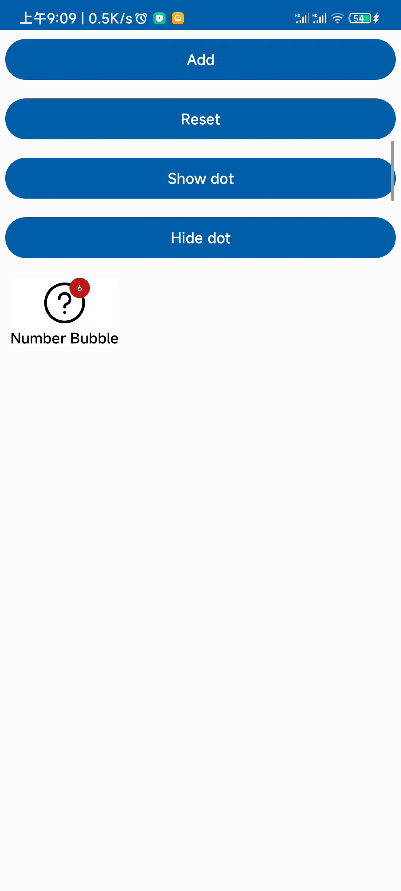

# Badge layout

[:octicons-tag-24: Version 0.5.3](https://ave.entropy2020.cn/version/tools/#053)

`BadgeLayout` provides `BadgeView` and `AppCompatImageView` by default, where the logo will be displayed in the upper right corner and the icon will be displayed horizontally in the center.

<figure markdown>
  
  <figcaption>BadgeLayout</figcaption>
</figure>

## Label

[:octicons-tag-24: Version 0.5.3](https://ave.entropy2020.cn/version/tools/#053)

`BadgeLayout` is only allowed to contain a view of type `TextView` to display labels. The following is sample code:

```xml
<com.ave.vastgui.tools.view.badgeview.BadgeLayout
    android:layout_width="wrap_content"
    android:layout_height="wrap_content"
    app:badge_mode="number">

    <com.google.android.material.textview.MaterialTextView
        android:layout_width="wrap_content"
        android:layout_height="wrap_content"
        android:text="Number Bubble" />

</com.ave.vastgui.tools.view.badgeview.BadgeLayout>
```

## Dot badge

[:octicons-tag-24: Version 0.5.3](https://ave.entropy2020.cn/version/tools/#053)

Calling `showDot` or `hideDot` to control dot badge.

```kotlin
// Show badge
mBinding.dotbadge.showDot()
// Hide badge
mBinding.dotbadge.hideDot()
```

## Bubble badge

[:octicons-tag-24: Version 0.5.3](https://ave.entropy2020.cn/version/tools/#053)

<figure markdown>
  { width="270" }
  <figcaption>气泡徽标动画</figcaption>
</figure>

## Sample code

[Sample code](https://github.com/SakurajimaMaii/Android-Vast-Extension/blob/develop/app/src/main/kotlin/com/ave/vastgui/app/activity/view/BadgeViewActivity.kt){ .md-button }
