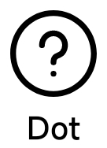
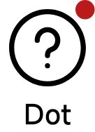

# Badge

[:octicons-tag-24: Version 0.5.3](https://ave.entropy2020.cn/version/tools/#053)

Badge currently supports **dot** and **bubble** mode.

|               Hide Dot                |               Show Dot                |               Hide Bubble                |               Show Bubble                |
| :---------------------------------------: | :---------------------------------------: | :---------------------------------------: | :---------------------------------------: |
|  |  |  |  |

## Quick start

[:octicons-tag-24: Version 0.5.3](https://ave.entropy2020.cn/version/tools/#053)

=== "Dot mode"

    `badge_mode` should be set to `dot` .

    ```xml
    <com.ave.vastgui.tools.view.badgeview.BadgeLayout
        android:layout_width="wrap_content"
        android:layout_height="wrap_content"
        app:badge_mode="dot">

        <com.google.android.material.textview.MaterialTextView
            android:layout_width="wrap_content"
            android:layout_height="wrap_content"
            android:text="Dot"
            ... />

    </com.ave.vastgui.tools.view.badgeview.BadgeLayout>
    ```

=== "Bubble mode"

    `badge_mode` should be set to `number` or `text` .

    ```xml
    <com.ave.vastgui.tools.view.badgeview.BadgeLayout
        android:layout_width="wrap_content"
        android:layout_height="wrap_content"
        app:badge_mode="number">

        <com.google.android.material.textview.MaterialTextView
            android:layout_width="wrap_content"
            android:layout_height="wrap_content"
            android:text="Number Bubble"
            ... />

    </com.ave.vastgui.tools.view.badgeview.BadgeLayout>
    ```

[Default style](https://github.com/SakurajimaMaii/Android-Vast-Extension/blob/develop/libraries/VastTools/src/main/res/values/styles.xml){ .md-button }
