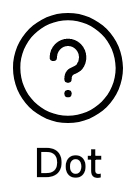
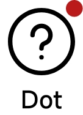

# 徽标

[:octicons-tag-24: Version 0.5.3](https://ave.entropy2020.cn/version/tools/#053)

徽标控件目前提供了**圆点**和**气泡**两种支持形式。

|               隐藏圆点徽标                |               显示圆点徽标                |                 隐藏气泡徽标                 |                 显示气泡徽标                 |
| :---------------------------------------: | :---------------------------------------: | :------------------------------------------: | :------------------------------------------: |
|  |  |  |  |

## 快速使用

[:octicons-tag-24: Version 0.5.3](https://ave.entropy2020.cn/version/tools/#053)

=== "圆点徽标"

    圆点徽标需要设置 `badge_mode` 属性为 `dot` 。

    ```xml
    <com.ave.vastgui.tools.view.badgeview.BadgeLayout
        android:layout_width="wrap_content"
        android:layout_height="wrap_content"
        app:badge_mode="dot">

        <com.google.android.material.textview.MaterialTextView
            android:layout_width="wrap_content"
            android:layout_height="wrap_content"
            android:text="Dot"
            ... />

    </com.ave.vastgui.tools.view.badgeview.BadgeLayout>
    ```

=== "气泡徽标"

    圆点徽标需要设置 `badge_mode` 属性为 `number` 或者 `text` 。

    ```xml
    <com.ave.vastgui.tools.view.badgeview.BadgeLayout
        android:layout_width="wrap_content"
        android:layout_height="wrap_content"
        app:badge_mode="number">

        <com.google.android.material.textview.MaterialTextView
            android:layout_width="wrap_content"
            android:layout_height="wrap_content"
            android:text="Number Bubble"
            ... />

    </com.ave.vastgui.tools.view.badgeview.BadgeLayout>
    ```

[查看默认样式](https://github.com/SakurajimaMaii/Android-Vast-Extension/blob/develop/libraries/VastTools/src/main/res/values/styles.xml){ .md-button }
